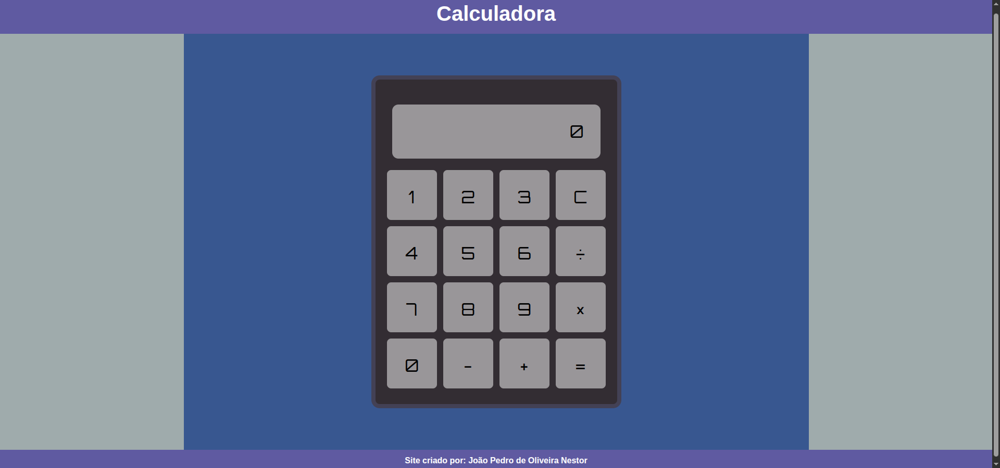
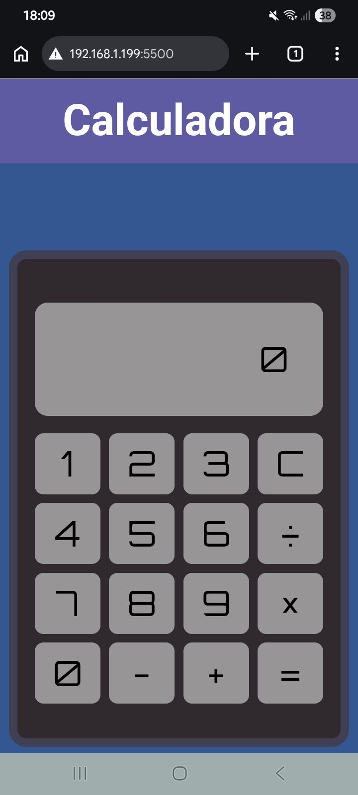

* Calculadora

Uma calculadora desenvolvida com **HTML, CSS e JavaScript**, criada como projeto de estudo para praticar desenvolvimento web e manipulação do DOM.

* Sobre o projeto

O projeto consiste em uma calculadora capaz de realizar operações matemáticas básicas através de uma interface gráfica.

O objetivo principal foi colocar em prática conceitos de **JavaScript**, além de desenvolver uma interface com **HTML e CSS** e torná-la responsiva para diferentes tamanhos de tela.

* Funcionalidades

- ➕ Adição
- ➖ Subtração
- ✖️ Multiplicação
- ➗ Divisão
- 🧹 Botão para limpar a calculadora
- 📱 Interface responsiva
- 🔢 Suporte a números com múltiplos dígitos

* Tecnologias utilizadas

- HTML5
- CSS3
- JavaScript

* O que foi praticado

Durante o desenvolvimento, foi desenvolvido:

- Manipulação do DOM
- `querySelector` e `querySelectorAll`
- Eventos com `addEventListener`
- Condicionais
- `switch/case`
- Funções
- Variáveis e operadores
- Responsividade com `@media`
- Organização de arquivos HTML, CSS e JavaScript

* Próximas melhorias

Algumas funcionalidades que podem ser adicionadas futuramente:

- Números negativos
- Números decimais
- Porcentagem
- Botão para apagar o último número
- Suporte ao teclado

* Preview

* Autor

**João Pedro de Oliveira Nestor**

Projeto desenvolvido para estudos de desenvolvimento web.
